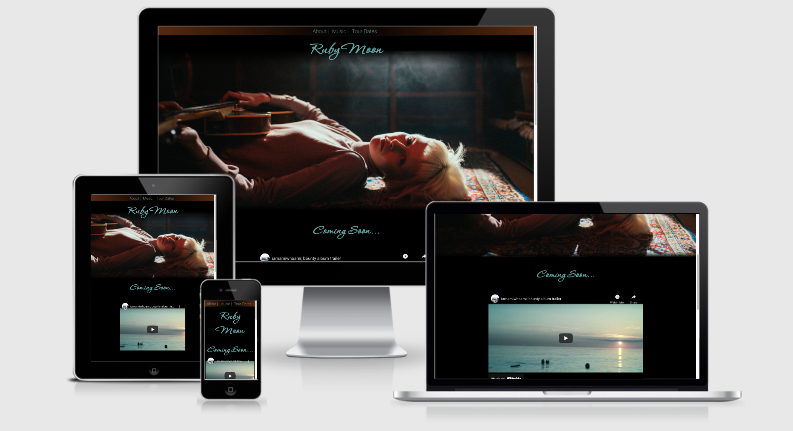
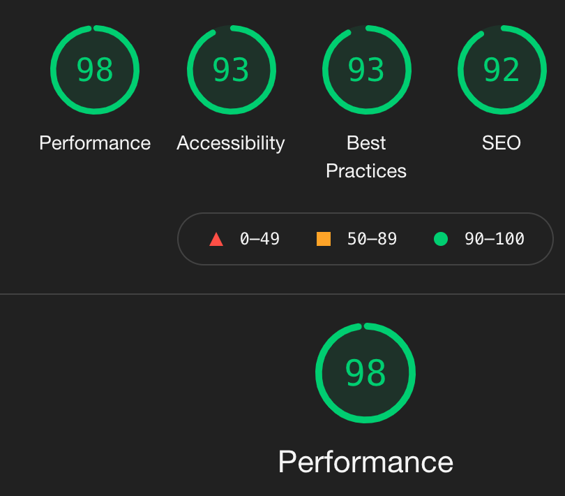

# Ruby Moon Website

[Click to view the website here](https://cintakins.github.io/Ruby-Moon/)
This website is designed to showcase the works of talented musician Ruby Moon, giving fans access to her music, tour dates and newsletter. The website will be designed to work on mobile phone, tablet and desktop computer screens.
## User Experience (UX Strategy)
- ### First Time Visitor
Users will probably already know the artist, but for those who don't know her, a clear hero image will portray who she is and give an indication to what her music might be like. They may want to read about the musician, view the latest music video and view discography.

For existing fans visiting the site for the first time, the image will act as confirmation that this is the correct website and they will want easy access to the resources, such as latest singles, discography, mailing list sign-up and tourdates.
- ### Returning visitor
A returning visitor may want to check tour dates and sign up for the newsletter as well as be shown the latest releases and future release dates.

A returning visitor may also want to contact the artist to book a performance or collaboration

They may be interested in being directed to social media sites to be updated with any news and interact with the musician.

- ### The Musician
The Musician will want to be presented as a succesful and talented musician. Her image will be important. She will want to promote her work, especially new/upcoming releases, and encourage visitors to sign up to her mailing list or social media pages to maintain exposure keeping potential customers interested and informed of new products, projects, tour dates and other news. There will need to be easy and obvious access to her music, and tour dates to promote sales. 

- ### Why a Website?
A website looks professional. It makes the musician look succesful, well established and therefore her music desirable. Users can trust that she can deliver the goods.

- ## Scope
The features of the website will include: 
- Professional visual representation of the musician
- An example of her work
- Promotion of new releases
- tour information and links for ticket booking
- An About section with a brief description and review section
- Discography and links to purchase her music
- Mailing list sign-up
- Social media links
- Contact information

- ## Structure
I have decided to balance what the user wants from the website with what the musician wants by having the features that are desirable for the user towards the top and features that the musician may want to promote down towards the bottom. This organisation also compliments the progression a user might go through as they explore the website, first finding what they initially visited it for, then discovering new features once they've satisfied their needs.
 For this reason I believe that the navigation should remain at the top, for familiarity and ease of use.
 On the landing page visual representation will be the first thing that the user will be looking for, for confirmation that they are at the correct website. That representation should be impactful and draw the user in to explore further. The needs of both the customer and musician are prioritised after the hero image, with the promotional video showcasing an example of the musicians work and upcoming release. Once the user is familiar with her music, they may want to book tickets for one of her concerts and if the musician is lucky, the user will sign up to the mailing list at the bottom, or subscriber to her social media pages.
  The nav bar at the top goes from left to right in order of which category might be most important for new users.

  - ## Wireframes
  - [Click to view desktop wireframe 'about'](docs/ruby-moon-desktop/desktop-about.png)
  - [Click to view desktop wireframe 'music'](docs/ruby-moon-desktop/desktop-music.png)
  - [Click to view desktop wireframe 'landing'](docs/ruby-moon-desktop/desktop-landing.png)
  - [Click to view small screen wireframe 'landing'](docs/ruby-moon-sm/sm-landing.png)
- [Click to view small screen wireframe 'about'](docs/ruby-moon-sm/sm-about.png)
 - [Click to view small screen wireframe 'music'](docs/ruby-moon-sm/sm-music.png)
  Breakpoints were determined by what size the display had problems.

## Design
- ### Colour Scheme
I have chosen 3 main colours for the website. A light teal colour to contrast against a dark hero background-image and black background (rgb(95, 165, 165)), mustard color (rgb(210, 132, 30)) and a brown colour (rgba(94, 45, 13, 0.9)).
- ### Typography
Two fonts were chosen.
The font for titles is Corinthia with a fallback of cursive. This is to make the page look stylish.
The main font has been chosen for ease of reading - Roboto (fallback font of san-serif)

## Languages Used
- HTML5
- CSS

## Programs Used
- (https://www.canva.com/) To design album covers.
- (https://www.pexels.com/) was used to find images.
- (https://www.youtube.com/) was used for the promotional video and social media link.
- (https://fontawesome.com/) was used for the icons.
- (https://fonts.google.com/) was used for fonts.
- (https://balsamiq.com/) was used for wireframes.
- (https://git-scm.com/) Was used for version control.
- (https://github.com/) stored the repository.
- (https://learn.codeinstitute.net/dashboard) and (https://www.w3schools.com/) was used for coding help and advise.

## Testing
- [Link to W3C HTML Validator](https://validator.w3.org/nu/?doc=https%3A%2F%2Fcintakins.github.io%2FRuby-Moon%2F)
- [Link to W3C CSS Validator](https://jigsaw.w3.org/css-validator/validator?uri=https%3A%2F%2Fcintakins.github.io%2FRuby-Moon%2F&profile=css3svg&usermedium=all&warning=1&vextwarning=&lang=en)
- Chrome tools lighthouse was used and results are shown here.

- The website was tested on a macbook using chrome and safari. There was a problem that Safari was not directing linking to the tour dates, but it was on chrome. The issue was an unneeded "/" before the file in the href attribute. The website was also tested on a samsung galaxy phone, and iphones and worked well, with the reported functional problems of the link not working and text overflowing it's container. Another problem reported was that the menu links did not look like menu links and so the user thought there was only one page to view. The user said that it was more obvious to him after I added vertical lines between the menu list items.

## Deployment
- In GitHub find the Ruby-Moon Repository and click on it.
- At the right towards the top of the page, click on settings.
- Scroll down the left hand menu to find the pages link.
- Select pages and select "main" in "branch" underneath 'Source' heading.
- The page is now published.